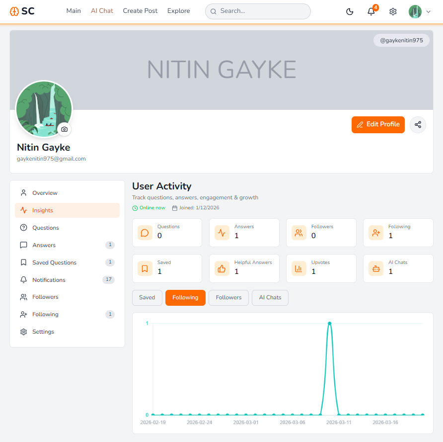

# Synthora – Generative AI Q&A Platform

## 📌 About the Project

**Synthora** is a next-generation **AI-powered Q&A platform** that blends **community-driven knowledge sharing with Generative AI intelligence**.

### It enables users to ask questions, receive answers from people, and leverage AI to:
- Evaluate answer quality
- Generate summaries
- Provide intelligent suggestions
- Deliver real-time interactive experiences

> 🚀 Designed to simulate a StackOverflow + ChatGPT hybrid system with real-time collaboration, AI evaluation, and personalized recommendations.

---

# 🎯 Project Goal
### To build a scalable system that:
- Enhances knowledge sharing
- Improves answer quality using AI
- Provides summarized and reliable insights
- Enables real-time collaboration

# 🖼️ UI Preview
 AI Chat | User Questions | Admin Dashboard |
|--------------|----------------|-----------------|
|  |  |  |

| User Profile | Create Question | Explore |
|--------------|-----------------|----------------|
|  |  |  |

