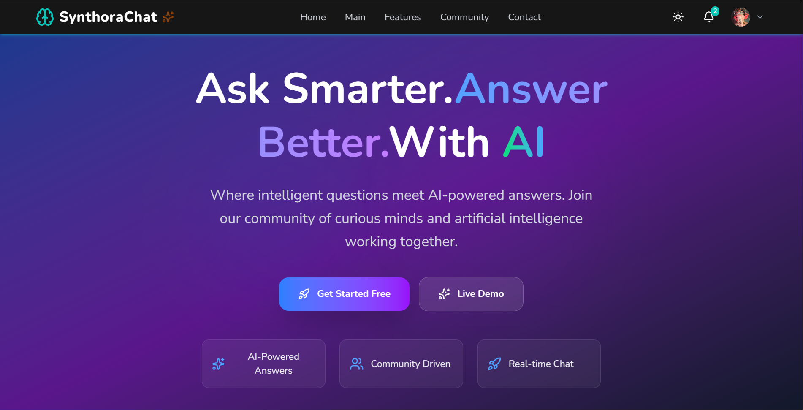
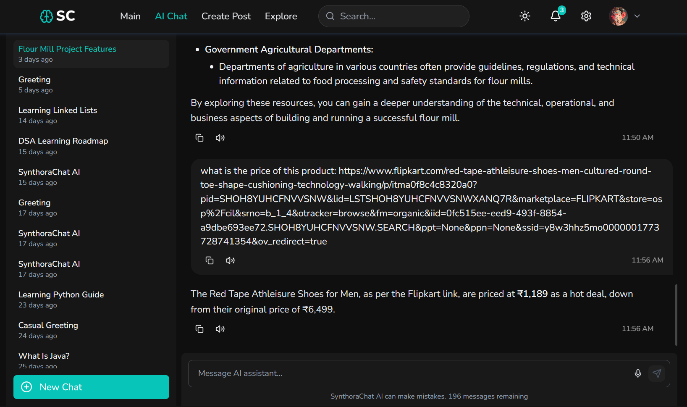
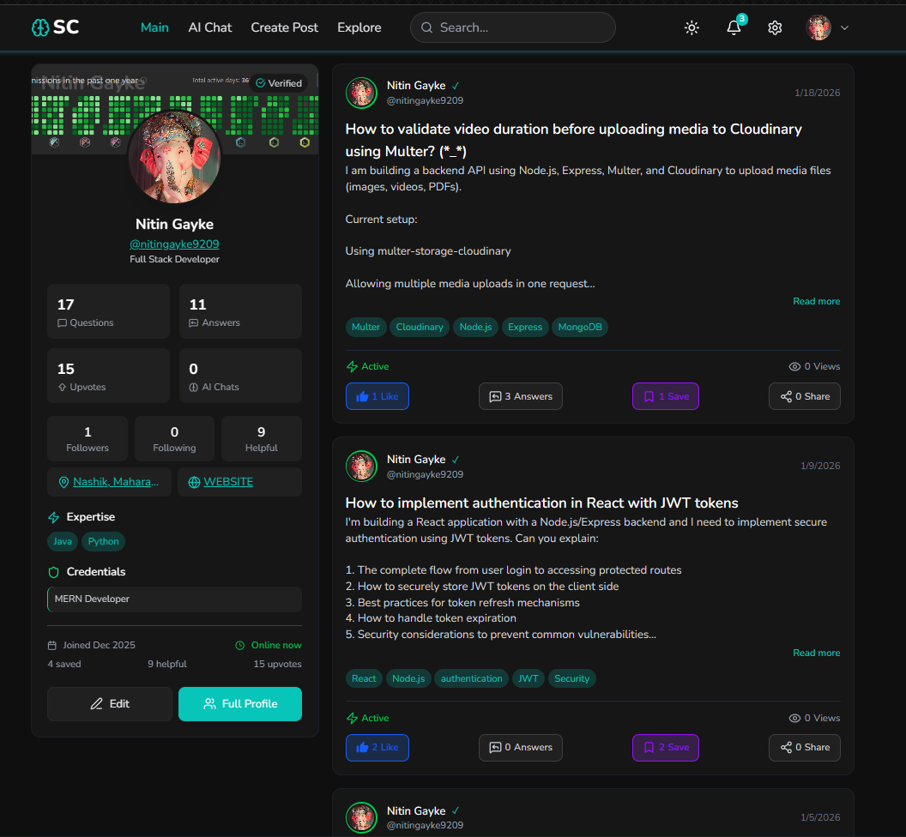
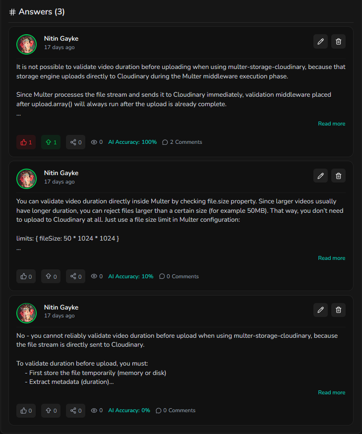
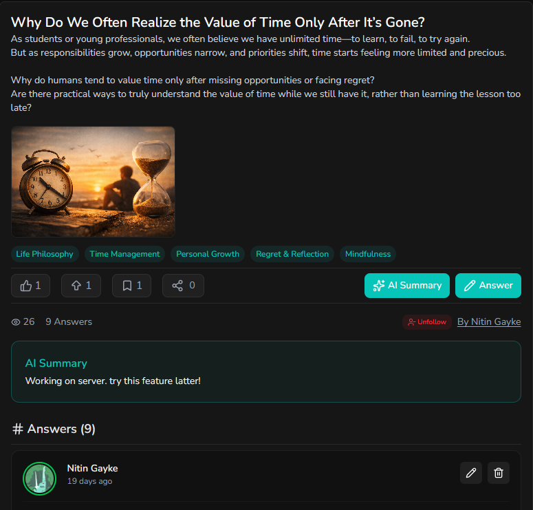
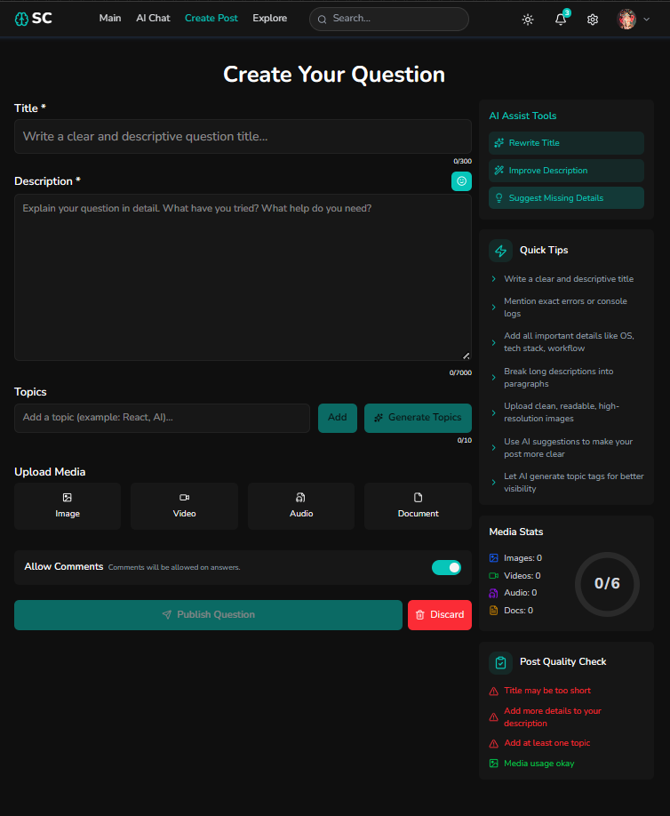
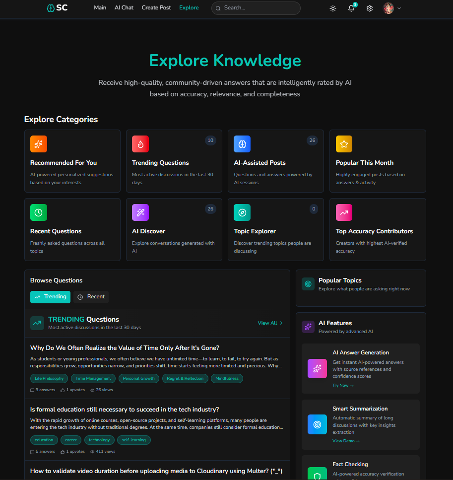
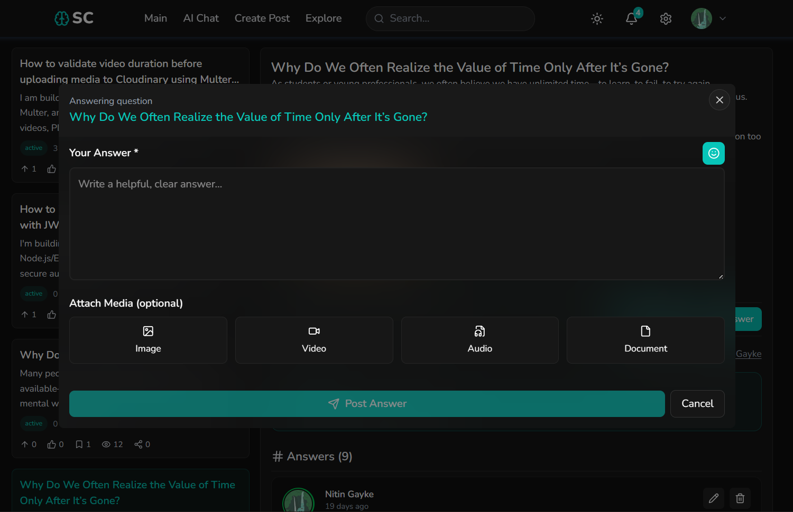
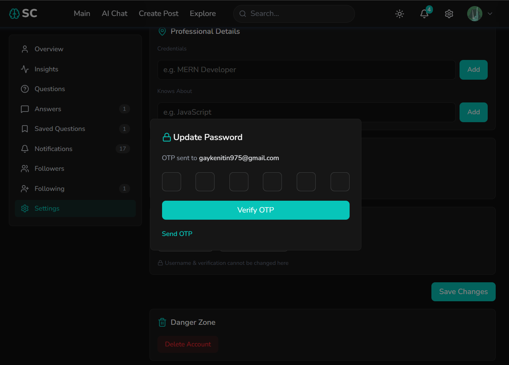
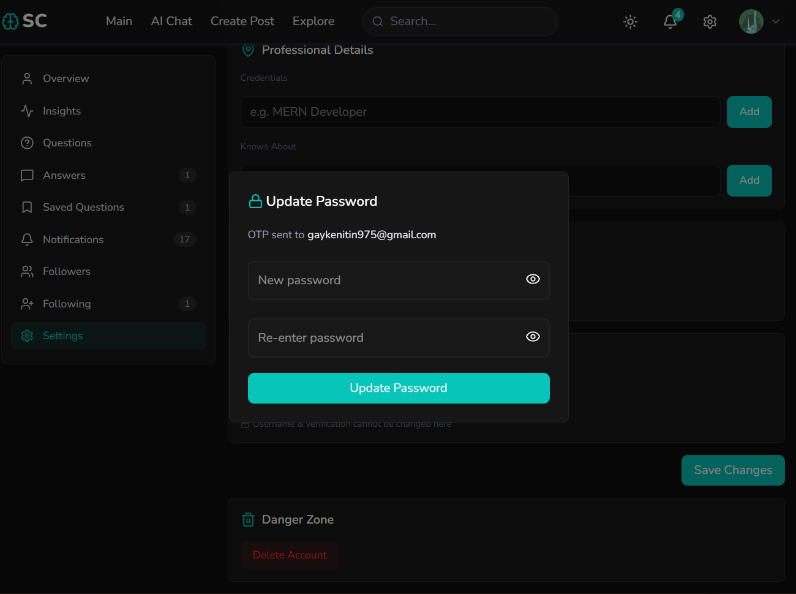

# 🚀 Synthora – Generative AI Q&A Platform



---

## 📌 About the Project

**Synthora** is a next-generation **AI-powered Q&A platform** that combines **community-driven knowledge sharing with Generative AI intelligence**.

It allows users to ask questions, receive answers from real users, and leverage AI to:

- Evaluate answer quality
- Generate summaries
- Provide intelligent suggestions
- Enable real-time interactive discussions

> 💡 Think of it as a **StackOverflow + ChatGPT hybrid** with real-time collaboration and AI-assisted learning.

---

## 🎯 Project Goal

To build a scalable platform that:

- Enhances knowledge sharing
- Improves answer quality using AI
- Provides reliable summarized insights
- Enables real-time collaboration

---

## 🖼️ UI Preview

### AI Chat | User Questions | Admin Dashboard
| AI Chat | Home | Analytics |
|--------|------|----------|
|  |  |  |

### Question Interface | Create Question | Explore
| Question | Create | Explore |
|----------|--------|--------|
|  |  |  |

### Answer | Password | Security
| Answer | Password Update | Reset |
|--------|----------------|-------|
|  |  |  |

---

## 🚀 Tech Stack

### 🖥️ Frontend (React + Vite)
- React 19 + Vite
- Tailwind CSS + Material UI
- Framer Motion (animations)
- Recharts / Chart.js
- React Markdown + Highlight.js
- Socket.IO Client (real-time)
- Google OAuth
- EmailJS (OTP + Contact System)

---

### ⚙️ Backend (Node.js + Express)
- Node.js + Express 5
- MongoDB + Mongoose
- JWT Authentication + bcrypt
- Socket.IO (real-time system)
- Cloudinary (media uploads)
- MVC + Service-based architecture

---

### 🤖 AI Server (FastAPI + LangChain)
- FastAPI
- LangChain Agents
- Google Gemini API
- Streaming responses (real-time AI output)
- Tool integrations (Tavily, Weather API, YouTube Loader, etc.)

---

## 🌐 Hosted Links

> 🚧 Deployment in progress

- Frontend: https://synthora-chat.vercel.app
- Backend: https://synthorachat.onrender.com 
- AI Server: https://synthora-ai-server.onrender.com

---

## 🔥 Core Features

### 💬 Community + AI Evaluation
- Users can answer questions
- AI evaluates answers based on:
  - Accuracy
  - Completeness
  - Relevance

---

### 🧠 AI Summarization
- Short summaries
- Detailed explanations
- Bullet-point insights
- Consensus answers

---

### 🤖 AI Chat System
- Real-time AI responses
- Context-aware answers
- Follow-up suggestions

---

### 📊 Recommendation System *(In Progress)*
- Personalized feed
- Suggested topics/questions

---

### 🔍 Advanced Search & Filters
- Sort by:
  - AI rating
  - Popularity
  - Recency
- Natural language search

---

### 🛡️ Quality & Reliability
- AI fact-checking
- Confidence scoring
- Conflict detection

---

### ⚡ Real-Time Features
- Live updates via Socket.IO
- Online/offline user tracking

---

### 📩 Email System (NEW)
- OTP verification using EmailJS
- Contact form integration (user → admin email)
- Snackbar-based UX notifications

---

### 🎨 User Experience
- Dark / Light mode
- Responsive UI
- Smooth animations
- Profile analytics


---

> # ⚙️ Installation Guide (Local Setup)

## 1️⃣ Clone Repository
```bash
git clone https://github.com/nitingayke/SynthoraChat.git
cd SynthoraChat
```

## 🖥️ Frontend Setup
```bash
cd client
npm install
npm run dev
```

## 🔐 Client Environment Variables
```env
VITE_EMAILJS_SERVICE_ID=
VITE_EMAILJS_OTP_TEMPLATE_ID=
VITE_EMAILJS_CONTACT_TEMPLATE_ID=
VITE_EMAILJS_PUBLIC_KEY=

VITE_GOOGLE_CLIENT_ID=
```

## ⚙️ Backend Setup (Node.js Server)
```bash
cd server
npm install
npm run dev
```

## 🔐 Server Environment Variables
```env
PORT=9090
JWT_SECRET=

DATABASE_USERNAME=
MONGO_PASSWORD=
MONGODB_URL=

CLOUDINARY_CLOUD_NAME=
CLOUDINARY_API_KEY=
CLOUDINARY_API_SECRET=
```

## 🤖 AI Server Setup (FastAPI)
### 1. Navigate to AI Server
```bash
cd ai-server
```

### 2. Create Virtual Environment
```bash
python -m venv venv
source venv/bin/activate   # Linux/Mac
venv\Scripts\activate      # Windows
```

### 3. Install Dependencies
```bash
pip install -r requirements.txt
```

### 4. Run Server
```bash
uvicorn main:app --reload --port 8000
```

# 🔐 AI Server Environment Variables
```bash
GEMINI_API_KEY=
GEMINI_MODEL_NAME=

WEATHERSTACK_API_KEY=
TAVILY_API_KEY=
```

> # 🔌 API Overview
- Auth APIs → Login, Register, OAuth
- Question APIs → Create, Fetch, Tagging
- Answer APIs → Post, Evaluate
- AI APIs → Chat, Summarization, Evaluation
- User APIs → Profile, Activity
- Analytics APIs → Engagement tracking

> 📊 Total APIs implemented: 38+

---

##  Connect With Me
If you're working on something similar, have questions, or want to collaborate, feel free to connect! I’d love to hear from you. 🚀

-  [LinkedIn](https://www.linkedin.com/in/nitin-gayke92/)
-  [Portfolio](https://nitin-portfolio-gilt.vercel.app/)
-  gaykenitin975@gmail.com
